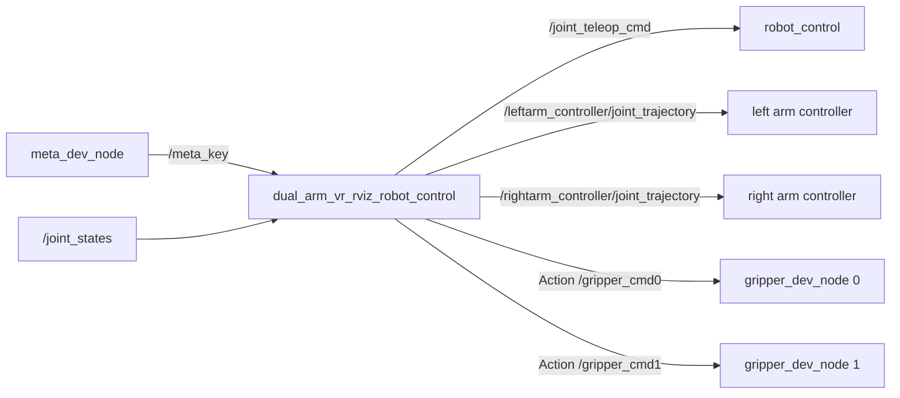

# Robot Relationship Diagram

Generated from current workspace content on 2026-03-31.

## System-Level Module Graph

```mermaid
graph TD
  subgraph StartOrchestration[launch.conf startup orchestration]
    LaunchConf["launch.conf"]
    LaunchScripts["launch_robot.sh / kill_robot.sh"]
  end

  subgraph InputAndDriver[Input and driver layer]
    MetaDev["meta_dev_node<br/>topic: /meta_key"]
    MotorDev["motor_dev_node"]
    ImuDev["imu_dev.launch.py"]
    ImgDev["img_dev.launch.py"]
    GripperDev["gripper_dev_node x2<br/>actions: /gripper_cmd0 /gripper_cmd1"]
    JointStates["/joint_states"]
    Cameras["/camera* image topics"]
  end

  subgraph ControlAndExecution[Control and execution layer]
    VrCtrl["dual_arm_vr_rviz_robot_control"]
    RobotControl["robot_control.launch.py"]
    DualArmAction["dual_arm_action_server.launch.py"]
    Brain["brain.launch.py<br/>(Cerebrum + Cerebellum)"]
    VisionDetect["vision_detect medical_sense.launch.py"]
  end

  subgraph HumanInteraction[Human interaction layer]
    VoiceLaunch["robot_speaker voice.launch.py"]
    Asr["asr_audio_node"]
    Tts["tts_audio_node<br/>service: /tts/synthesize"]
    SpeakerCore["robot_speaker_node"]
    SkillBridge["skill_bridge_node<br/>sub: /llm_skill_sequence<br/>client: /cerebrum/rebuild_now"]
    CtrlGui["ctrlgui.launch.py"]
    WebUI["Web UI :8080"]
  end

  subgraph TopicsAndActions[Key ROS interfaces]
    ExecuteBtAction["/execute_bt_action"]
    SkillStats["/brain/skill_stats"]
    RebuildSrv["/cerebrum/rebuild_now"]
    TeleopCmd["/joint_teleop_cmd"]
    LeftTraj["/leftarm_controller/joint_trajectory"]
    RightTraj["/rightarm_controller/joint_trajectory"]
    VisionPose["/pose/cv_detect_pose"]
    VisionImage["/image/detect_image"]
    VisionObjRec["/vision_object_recognition"]
    RobotWorkInfo["/robot_work_info"]
  end

  LaunchConf --> LaunchScripts
  LaunchConf --> MotorDev
  LaunchConf --> ImuDev
  LaunchConf --> ImgDev
  LaunchConf --> GripperDev
  LaunchConf --> Brain
  LaunchConf --> RobotControl
  LaunchConf --> DualArmAction
  LaunchConf --> VisionDetect
  LaunchConf --> VoiceLaunch
  LaunchConf --> CtrlGui

  MetaDev -->|/meta_key| VrCtrl
  JointStates --> VrCtrl
  VrCtrl --> TeleopCmd
  VrCtrl --> LeftTraj
  VrCtrl --> RightTraj
  VrCtrl -->|action client| GripperDev
  GripperDev --> JointStates

  TeleopCmd --> RobotControl
  DualArmAction --> RobotControl

  VisionDetect --> VisionPose
  VisionDetect --> VisionImage
  Brain -->|service/action call| VisionObjRec

  Brain <--> ExecuteBtAction
  Brain --> SkillStats
  SkillBridge --> RebuildSrv
  SkillBridge --> ExecuteBtAction

  VoiceLaunch --> Asr
  VoiceLaunch --> Tts
  VoiceLaunch --> SpeakerCore
  Asr --> SpeakerCore
  SpeakerCore -->|publish skill sequence| SkillBridge
  SpeakerCore -->|tts client| Tts

  CtrlGui --> WebUI
  CtrlGui --> ExecuteBtAction
  CtrlGui --> RebuildSrv
  CtrlGui -->|gripper actions| GripperDev
  CtrlGui --> JointStates
  CtrlGui --> RobotWorkInfo
  Cameras --> CtrlGui
```

## VR Dual-Arm Control Data Flow

## Source Basis

- launch orchestration: launch.conf
- VR node interfaces: hivecore_robot_VR/src/dual_arm_robot_control/src/dual_arm_vr_rviz_robot_control.cpp
- brain architecture: hivecore_robot_brain/src/brain/README.md
- skill registry: hivecore_robot_brain/src/brain/config/robot_skills.yaml
- voice chain: hivecore_robot_voice/launch/voice.launch.py and robot_speaker/bridge/skill_bridge_node.py
- GUI interfaces: hivecore_robot_ctrlgui/ctrlgui/node/ctrlgui_node.py
- vision topics: hivecore_robot_vision/README.md
